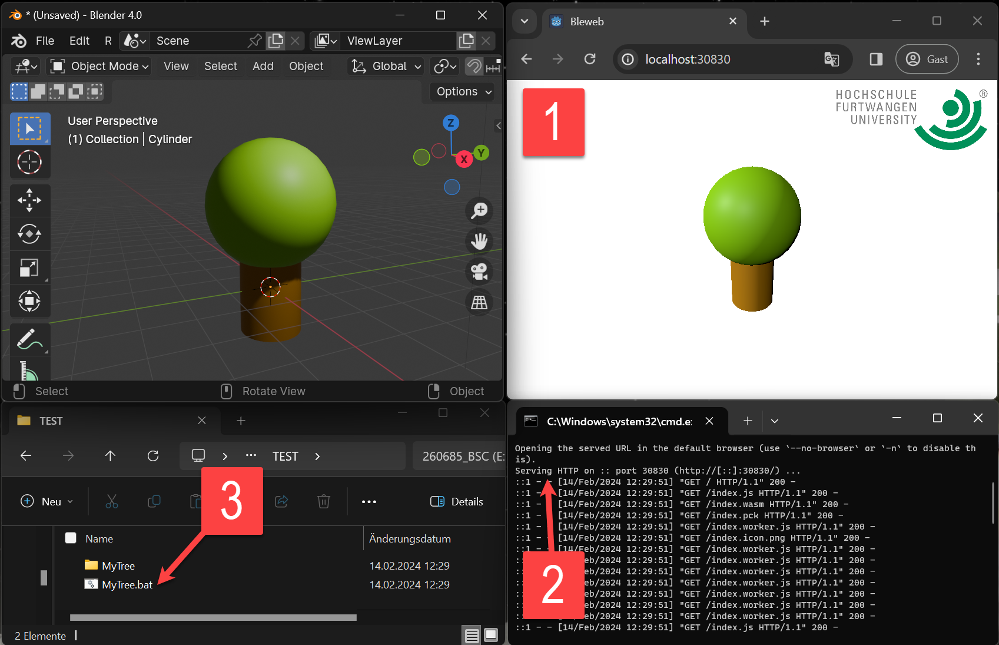

# BlenderWebGodot

An add-on for Blender to quickly publish the 3D-contents of a [Blender](https://www.blender.org/) file to an interactive HTML application displayable in standard web browsers.

The export is carried out internally by the [Godot Game Engine](https://godotengine.org/).

## Installation

1. Download [io_export_webgo.zip](https://github.com/griestopf/BlenderWebGodot/releases/latest/download/io_export_webgo.zip) from the [latest release](https://github.com/griestopf/BlenderWebGodot/releases/latest)
2. Open Blender

3. Open the "_Blender Preferences_" window ("Edit → Preferences" or `Ctrl + ','`).
4. Open the Add-ons Tab.
5. Click the "_Install..._" button.

6. In the file selector dialog, navigate to the location of the downloaded io_export_webgo.zip file and select it.
7. Click the "_Install Add-on_" button.

8. Make sure the newly installed Add-on ("_Import-Export: Export to Web (powered by Godot)_") is displayed. If not entered automatically, enter "Export to Web" into the search box.

9. Expand the Add-on details by clicking on the arrow button and activate the Add-on by checking the check-box.

10. Download Godot by clicking the "_Download Godot_" button.

11. Close the "_Blender Preferences_" dialog.

## Exporting

1. To export the current 3D-contents of your Blender file, go to File → Export → Web Exporter.

2. In the file export dialog, make sure "_✓ Godot 4 is present_" is displayed on top of the right sidebar. If not, make sure Godot was downloaded from the Add-On preferences as desribed in point 10 under [Installation](#installation). Keep the "_Open export in web browser_" option checked, if you want to inspect the generated web contents locally in your web browser directly after export. Uncheck the option, if you only want to export the file without having your web browser opened to display the file.

3. Choose a place to save your web export. Depending on the platform you are working on, the file export dialog will prompt you to either choose a ".bat" file (Windows), a ".command" file (macOS) or a ".bash" file (Linux). This will be the file allowing you to start the web browser locally on your machine by double-clicking it. The web-application containing your exported 3D contents will be written to a sub-folder with the same name. Hit "_Export Web_" to start the export process.

## Running locally

1. If the "_Open export in web browser_" option was checked on [export](#exporting), your standard web browser is automatically started showing the exported 3D contents.

2. To enable the browser to load contents locally (from `localhost`), a local web server is started on a free port serving the contents of the exported directory. Depending on the platform you are running on (Windows, Linux or macOS), the web server process will be started in a console window.

3. To (re-)start the local web server and the web browser manually (at a later time, or if the "_Open export in web browser_" option was **not** checked on [export](#exporting)), double-click on the generated file you chose on export (the ".bat" file (Windows), the ".command" file (macOS) or the ".bash" file (Linux)). 

## Publishing on the Web

1. Copy the contents of the generated folder to a web server you possess access to. Open the "index.html" file present in that folder using a URL to the sub-folder name.

