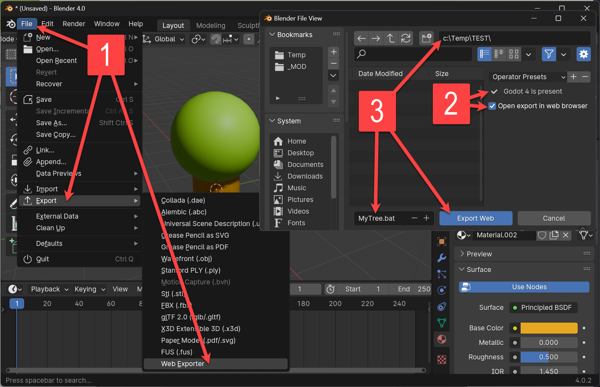

# BlenderWebGodot

An add-on for Blender to quickly publish the 3D-contents of a [Blender](https://www.blender.org/) file to an interactive HTML application displayable in standard web browsers.

The export is carried out internally by the [Godot Game Engine](https://godotengine.org/).

## Installation

1. Download [io_export_webgo.zip](https://github.com/griestopf/BlenderWebGodot/releases/latest/download/io_export_webgo.zip) from the [latest release](https://github.com/griestopf/BlenderWebGodot/releases/latest)
2. Open Blender

3. Open the Blender Preferences window ("Edit → Preferences" or Ctrl+,).
4. Open the Add-ons Tab.
5. Click the Install button.

6. Goto the location of the downloaded io_export_webgo.zip file and select it.
7. Click the Install Add-on button.

8. Make sure the newly installed Add-on ("_Import-Export: Export to Web (powered by Godot)_") is displayed. If not entered automatically, enter "Export to Web" into the search box.

9. Expand the Add-on details by clicking on the arrow button and activate the Add-on by checking the check-box.

10. Download Godot by clicking the "Download Godot" button.

11. Close the Blender Preferences dialog.

## Exporting

1. To export the current 3D-contents of your Blender file, go to File → Export → Web Exporter.

2. Choose a place to save your web export. Depending on the platform you are working on, The file export dialog will prompt you to either choose a ".bat" file (Windows), a ".command" file (Mac OS) or a ".bash" file (Linux). This will be the file allowing you to start the web browser locally on your machine by double-clicking it. The web-application containing your exported 3D contents will be written to a sub-folder with the same name.

## Running locally

1. Double-click on the generated file you chose on export.

## Publishing on the Web

1. Copy the contents of the generated folder to a web server you possess access to. Open the "index.html" file present in that folder using a URL to the sub-folder name.

